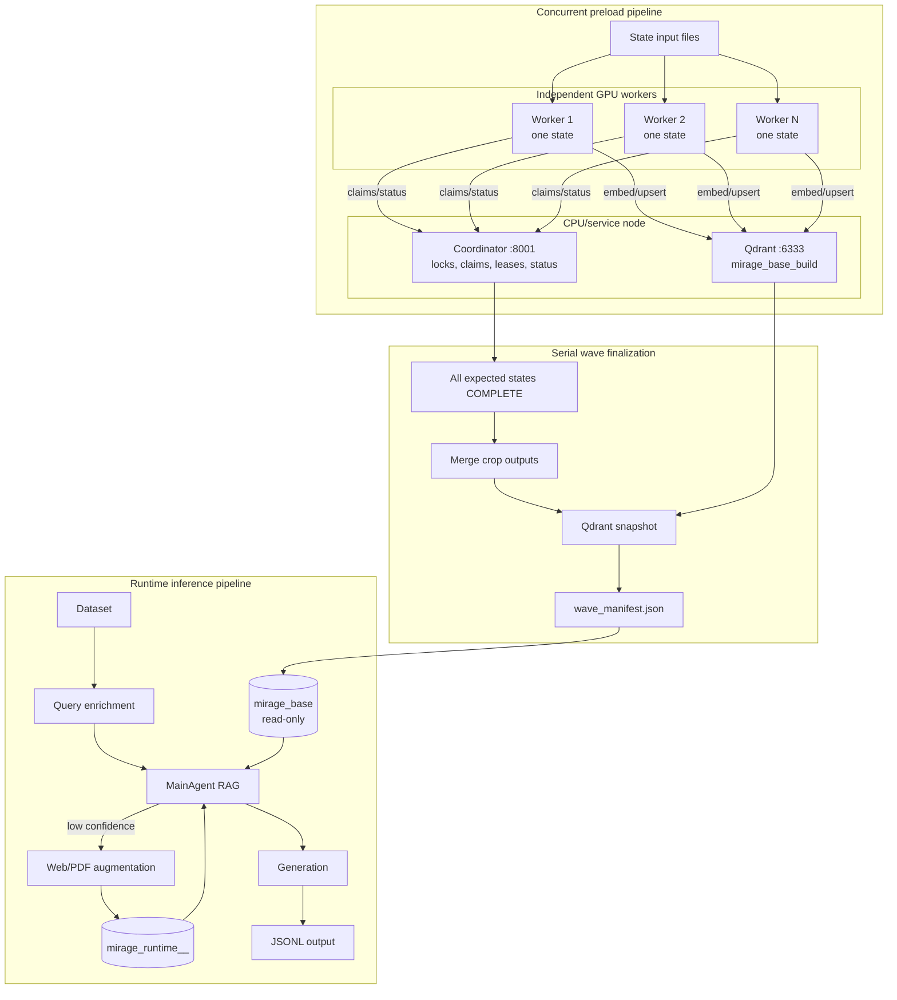
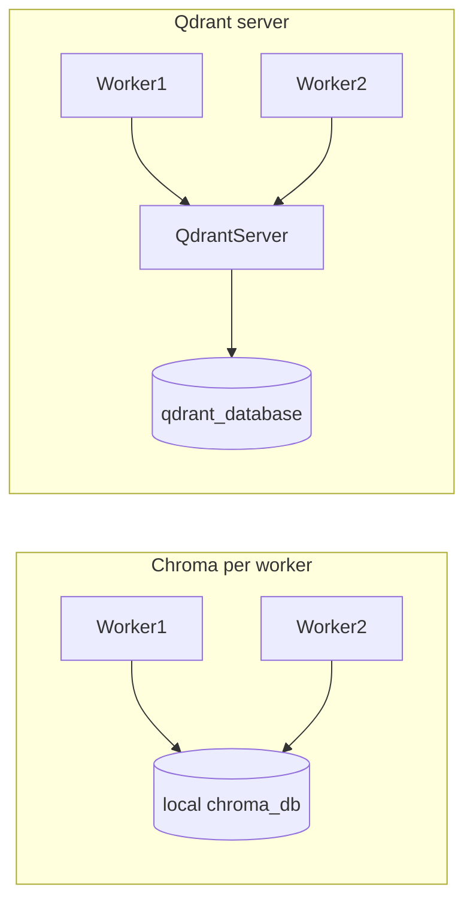

# MIRAGE-RAG — End-to-end pipeline guide

This document describes the current Qdrant-backed runtime, batch inference, and evaluation workflows.

---

## 1. Introduction and repository map

### 1.1 What this system does

MIRAGE-RAG is built around a **retrieval-augmented** workflow backed by a **Qdrant** vector store in **server mode**. Documents are chunked, embedded in-process, and stored in Qdrant with metadata (including location and hardiness zone where applicable). RAG workers connect to the Qdrant server over HTTP—they do not open local database files directly. At query time, an LLM-driven **RAG agent** retrieves evidence, evaluates confidence, and may search the web and ingest new pages when confidence is low.

**Batch inference** (`Inference/generate.py`) runs many items through that RAG stack and then a separate **generation** step, using a multi-process, GPU-aware layout so RAG load is controlled and scalable.

### 1.1.1 Current architecture

The repository has separate pipelines for preload, runtime inference, and wave
finalization. The preload workers communicate with the coordinator for control
state and write vectors directly to the single Qdrant service.



### 1.2 Main directories


| Path                | Role                                                                                                                                                                                                                                                         |
| ------------------- | ------------------------------------------------------------------------------------------------------------------------------------------------------------------------------------------------------------------------------------------------------------ |
| `rag_agent/`        | Qdrant client (`QdrantStore`), embeddings, chunking utilities, tools (retrieve, confidence, web search, web/PDF ingestion, keywords), and `MainAgent` (Google ADK `LlmAgent` + `InMemoryRunner`). |
| `Inference/`        | `generate.py`: dataset → RAG queue → per-GPU workers → generation pool → JSONL output. Optional crop **query enrichment** before RAG.                                                                                                                        |
| `Evaluation/`       | LLM-as-a-judge scoring for identification and management benchmarks, plus score summaries.                                                                                                  |
| `chat_models/`      | Clients used by generation (and related chat flows).                                                                                                                                                                                                         |
| `Datasets/`         | Reference data (e.g. land-grant universities for URL-derived location).                                                                                                                                                                                      |


Run batch jobs from the `Inference/` directory. Before starting workers, run the **Qdrant server** and set `QDRANT_URL` (see [§2.1](#21-qdrant-server-and-base-runtime-collections) and [§3.2](#32-starting-the-qdrant-server)).

### 1.3 Hugging Face cache on cluster storage

Set the Hugging Face cache to the 1 TB storage volume before installing dependencies or launching model servers. This prevents model downloads from filling the home or system filesystem.

```bash
mkdir -p /projects/bfox/ssingh38/huggingface_cache/hub
mkdir -p /projects/bfox/ssingh38/triton_cache
export HF_HOME=/projects/bfox/ssingh38/huggingface_cache
export HUGGINGFACE_HUB_CACHE=/projects/bfox/ssingh38/huggingface_cache/hub
export TRITON_CACHE_DIR=/projects/bfox/ssingh38/triton_cache

echo $HF_HOME
echo $HUGGINGFACE_HUB_CACHE
echo $TRITON_CACHE_DIR
```

### 1.4 How to read this guide

- **Sections 2–4** cover shared Qdrant concepts, runtime inference, and evaluation.
- **Sections 5–6** cover **batch inference** and **runtime RAG agent** behavior.
- **Section 7** covers ablation controls and the run matrix; **Section 8** is an operational checklist (cluster jobs, pre-run checks, monitoring, environment setup); **Section 9** lists primary files and doc references.
- **§3.1** covers local LLM servers; **§3.2** covers **starting the Qdrant server** (copy-paste steps).

---

## 2. Core concepts and shared artifacts

### 2.1 Qdrant server and base/runtime collections

- Inference uses two isolated Qdrant collections: **`mirage_base`** and one run-scoped **`mirage_runtime_<ABLATION_ID>_<YYYYMMDD>_<HHMMSS>`** collection.
- `mirage_base` is the curated offline preload database. Inference treats it as read-only: it may verify, search, scroll, and count it, but never creates, resets, deletes, or upserts it.
- The runtime collection is created or resumed by `InferenceDatabaseManager`, shared by all workers for one run, and receives web/PDF augmentation. It is deleted only after successful completion; failures and interruptions preserve it for resume.
- Set `USE_BASE_COLLECTION=False` (CLI: `--use_base_collection false`) only for runtime-only development/testing while `mirage_base` is unavailable. This skips base verification, retrieval, and base deduplication but uses the same lifecycle, retriever, ingestion, and confidence path.
- `MainAgent` connects with `QdrantClient(url=...)` to a **running Qdrant server**. Set the URL via environment variable **`QDRANT_URL`** (default `http://127.0.0.1:6333`) or constructor argument `qdrant_url=...`. Optional **`QDRANT_API_KEY`** for secured deployments.
- **On-disk storage** is owned by the Qdrant **server process**, not by each worker. Inference never discovers, copies, restores, or directly reads Qdrant storage directories. On this cluster, the typical storage path is `/work/nvme/bfox/ssingh38/qdrant_database`, configured when starting the server with **`QDRANT__STORAGE__STORAGE_PATH`** (see [§3.2](#32-starting-the-qdrant-server)).
- **Embeddings** are computed in-process by `SentenceTransformerEmbeddingFunction`; vectors are sent to Qdrant on upsert and query via `rag_agent/utils/qdrant_store.py` (`QdrantStore`).
- **Embedding model** should stay aligned between notebook preload and runtime retrieval to avoid vector/schema mismatches.
- **Device** for the sentence-transformer embedder should match (`--device` / `device`, often `"None"` for auto).

#### 2.1.1 Why we moved from ChromaDB to Qdrant (server mode)

Previously, each RAG worker opened the same Chroma persistence directory with `chromadb.PersistentClient(path=...)`. That caused problems in multi-worker batch inference:

- **Unsafe concurrent writes:** multiple workers reading/writing the same local SQLite/HNSW files risked contention and corruption.
- **Stale collection handles:** in the historical Chroma implementation, rank-0 collection resets could invalidate other workers' cached collection UUIDs. The current Qdrant architecture uses an externally managed server and a driver-owned runtime name, so workers do not perform resets.

**Qdrant server mode** fixes this: one Qdrant process owns storage on NVMe; all workers are HTTP clients to that single server. Concurrent upserts and queries are handled safely server-side.



**Operational model (three terminals):**

| Terminal | Role |
| -------- | ---- |
| 1 | Qdrant server (`~/bin/qdrant` with `QDRANT__STORAGE__STORAGE_PATH=...`) |
| 2 | GPU LLM server(s) + `Inference/generate.py` workers (`export QDRANT_URL=...`) |
| 3 | Batch driver (`Inference/bash_generate.sh` or your inference script) |

For migration details, see [MSCdocs/CHROMADB_TO_QDRANT_MIGRATION.md](MSCdocs/CHROMADB_TO_QDRANT_MIGRATION.md).

### 2.2 Two different artifacts: vector DB vs crop dictionary


| Artifact                            | Purpose                                                                                                                             | Consumed by                                                                                      |
| ----------------------------------- | ----------------------------------------------------------------------------------------------------------------------------------- | ------------------------------------------------------------------------------------------------ |
| **Qdrant base/runtime collections** (chunks + embeddings) | Curated retrieval plus run-scoped runtime augmentation | `DualCollectionRetriever`, confidence, and runtime-only web/PDF ingestion |
| **Crop dictionary JSON**            | Optional **query enrichment** only: may insert crop names into the user question when the query implies a crop but does not name it | `CropQueryEnricher` in `rag_agent/crop_query_enrichment.py`, called from `Inference/generate.py` |


The crop dictionary does **not** replace or duplicate the vector store; it only rewrites the **text** of the user message (with strict rules) before RAG runs.

### 2.3 Metadata — policy, storage, retrieval, and search

Project metadata policy includes:

- `**location`**: Used to derive `**hardiness_zone`** via `rag_agent.utils.metadata` helpers. Preferred forms: `**"State"**` or `**"State, County"**` (full state name or two-letter abbreviation).
- `**hardiness_zone**`: Expected when `location` resolves; may be empty if lookup cannot resolve.
- `**month_year**`: Runtime web-search ingestion derives/validates `month_year` from search/page metadata per `rag_agent` tools.

#### 2.3.1 Canonical metadata stored on each chunk

Runtime ingestion paths (web and PDF) attach metadata through `rag_agent.utils.metadata.build_canonical_chunk_metadata`. Typical **canonical keys** stored in each chunk **payload** in Qdrant include:


| Field            | Role                                                                                                                                                                                          |
| ---------------- | --------------------------------------------------------------------------------------------------------------------------------------------------------------------------------------------- |
| `source_type`    | Origin class (e.g. web, pdf, csv) for provenance and debugging.                                                                                                                               |
| `source_id`      | Stable identifier for the source record or URL slug.                                                                                                                                          |
| `title`          | Page or document title; used in **progressive retrieval** when the agent passes a `title` filter and in confidence **scope** scoring.                                                         |
| `url`            | Source URL or synthetic identifier; provenance and dedupe context.                                                                                                                            |
| `page`           | Page index within a PDF or logical page.                                                                                                                                                      |
| `chunk_index`    | Which token chunk within the page/record.                                                                                                                                                     |
| `location`       | Geographic scope you asserted at ingest time (`State` or `State, County`); drives **hardiness_zone** derivation when not passed explicitly.                                                   |
| `month_year`     | Publication or snapshot month `**YYYY-MM`** when known; enables time-scoped retrieval filters.                                                                                                |
| `content_hash`   | Hash of normalized chunk text; used to **skip duplicate** chunks on re-ingestion.                                                                                                             |
| `language`       | Document language tag when detected or defaulted.                                                                                                                                             |
| `hardiness_zone` | USDA-style zone string derived from `**location`** via `extract_hardiness_zone_for_location` (and county/state datasets); **required for location-aware filtering** when the lookup succeeds. |


Extra keys may be merged via `extra_metadata` on some paths (e.g. CSV tags). Empty or unknown values are often stored as sentinel placeholders in tools (`__null__` / `-1` patterns in `MainAgent`), while retrieval treats strings like `NULL`, `N/A` as missing when filtering.

**Why `location` matters:** without a resolvable location, `hardiness_zone` may be empty, weakening metadata filters and making extension-style retrieval less precise.

#### 2.3.2 How query-time inputs map to filters

`retrieve_content` / `_tracked_retrieve_content` pass optional `**location`**, `**month_year`**, and `**title**` into `ContentUtils.retrieve_with_priority_filters`. The `**location` string is not matched directly** on chunks for filtering; it is normalized and used only to **derive `hardiness_zone`** (see comment in `ContentUtils.py`). Batch inference sets `MainAgent.current_location` from the dataset so the effective location matches the user’s state/county when the model omits an explicit location argument.

#### 2.3.3 Eligible candidate filters (the “priority ladder”)

`ContentUtils.retrieve_with_priority_filters` builds a **list of candidate strategies** (`filter_attempts`). Each entry is a `(strategy_name, where_filter)` pair. A strategy is **only added** if every metadata field it needs is present after cleaning (see §2.3.2): e.g. `hardiness_zone+month_year+title` is skipped unless `**hardiness_zone`**, `**month_year`**, and `**title**` are all non-empty.

The **append order** encodes design intent (prefer combinations that tie chunks to place, time, and document identity when data exists):

1. `hardiness_zone` + `month_year` + `title`
2. `hardiness_zone` + `title`
3. `title` alone
4. `month_year` alone
5. `hardiness_zone` + `month_year`
6. `hardiness_zone` alone
7. `**semantic_only`** — `where` is omitted; pure embedding similarity over the full collection.

If the query supplies no usable `title`/`month_year`/derived `hardiness_zone`, several combined strategies never appear, and the list may reduce to `**month_year`**, `**hardiness_zone**`, and/or `**semantic_only**` depending on what remains. That is why consistent ingest metadata improves precision when the user’s region and time are known.

**Important:** this ladder is **not** “first strategy that returns enough hits wins.” See §2.3.4.

#### 2.3.4 Priority retrieval: evaluation loop, similarity formula, and winner selection

Implementation reference: `rag_agent/utils/ContentUtils.py` — `retrieve_with_priority_filters`.

**Concept.** *Priority retrieval* means: for one user query, run **one Qdrant search per candidate strategy** (each with the same query embedding and `limit=k`, default 5). Every strategy that returns at least **`min_results`** hits (default 1) is **valid**. Among valid strategies, the implementation picks the one with the **highest normalized similarity score** (not the first in the list). So a broader filter can win if its top-k hits are semantically stronger than a stricter filter’s hits.

**Per-hit similarity.** Qdrant returns a cosine **score** where higher is better. The retrieval pipeline uses that raw score directly as `similarity`; no Chroma-compatible distance conversion is performed:

```text
s_i = qdrant_score_i
```

**Strategy score (normalized score for one candidate).** Let `n` be the number of documents returned for that query (up to `k`). The strategy’s aggregate score is the **mean** of the transformed per-hit similarities:

```text
normalized_score = (1 / n) * Σ [1 / (2 - s_i)]   for i = 1..n     (or 0 if n = 0)
```

**Worked example.** Suppose two filter strategies each return two chunks for the same query:

| Strategy | Chunk 1 similarity | Chunk 2 similarity | Mean transformed score (`normalized_score`) |
| -------- | -----------------: | -----------------: | ------------------------: |
| `title` | 0.82 | 0.76 | **0.827** |
| `semantic_only` | 0.68 | 0.71 | 0.766 |

The `title` strategy wins because `0.827 > 0.766`. Since these are Qdrant cosine similarities, the larger number is always the stronger match. The returned chunks are also ordered from highest raw similarity to lowest raw similarity.

**Why the old transformation could matter.** Before raw similarity became canonical, the same comparison used `f(q) = 1 / (2 - q)` and averaged the transformed values. That transformation preserves the order of individual chunks, but not necessarily the order of strategy averages:

| Strategy | Raw Qdrant similarities | Raw mean | Mean after old `1 / (2 - q)` transformation |
| -------- | ----------------------- | -------: | -------------------------------------------: |
| A | 0.71, 0.71 | **0.710** | 0.7752 |
| B | 0.40, 0.99 | 0.695 | **0.8075** |

The current transformed strategy score selects **B**, while raw mean scoring would select **A**. This is why the current system keeps raw Qdrant scores as the canonical values but applies the nonlinear transformation for progressive strategy selection; researching alternative aggregation methods remains a separate follow-up.

`normalized_score` is the arithmetic mean of the transformed raw Qdrant cosine similarities. The mean-scoring method is intentionally unchanged; the nonlinear transformation is applied only for progressive strategy selection. Raw similarities remain available for returned hits and confidence evaluation.

**Winner selection.**

1. Evaluate **all** candidates in `filter_attempts` (including `semantic_only`).
2. **Valid** strategies are those with `doc_count >= min_results`.
3. If any valid strategy exists, choose
  `best_strategy = argmax normalized_score`  
   over valid strategies, breaking ties by Python’s `max` ordering on the list (deterministic given fixed evaluation order).
4. Return the `**where` clause**, **strategy name**, and **formatted hit list** from that winner. If none are valid, return `("no_results", [])` with no filter.

**Parameters.**


| Parameter     | Role                                                                                      |
| ------------- | ----------------------------------------------------------------------------------------- |
| `k`           | Top-k hits per strategy (`limit` in Qdrant / `k` in code).                                          |
| `min_results` | Minimum `doc_count` for a strategy to participate in the max-score selection (default 1). |


**Why this design.** Stricter metadata filters shrink the corpus; if that subset has weak embedding matches, a **looser** filter (or `semantic_only`) can still win on **average similarity**, keeping retrieval grounded in vector relevance while using metadata when it helps.

#### 2.3.4.1 Base/runtime result merging

When the curated base collection is enabled, `DualCollectionRetriever` applies the priority-retrieval process above **independently** to each collection:

```text
base collection    -> best base strategy    -> up to k base chunks
runtime collection -> best runtime strategy -> up to k runtime chunks
                                      |
                                      v
                         merge the winning chunk lists
                                      |
                         cross-collection deduplication
                                      |
                    global similarity sort and final top-k
```

The system does **not** compare the base and runtime strategies and select only one collection’s result set. It also does not merge every chunk returned by every candidate strategy. Instead, each collection first keeps only its own winning strategy and its chunks; those two winning lists are then combined.

Cross-collection duplicates are identified using `content_hash`, then `chunk_id`, then the chunk text as a fallback key. If the same content is present in both collections, the base result is retained. Remaining results are sorted globally by raw Qdrant cosine similarity, with higher scores first, and the final top `k` chunks are returned. Each result includes `retrieval_source` (`base` or `runtime`).

The returned `strategy` field is a diagnostic/confidence label. It is selected from the collection evaluation with the larger result count; it does not replace the globally merged and ranked evidence. Web/PDF augmentation writes only to the runtime collection, so newly ingested evidence participates in subsequent retrievals without mutating the curated base.

#### 2.3.5 Score semantics follow-up research

The current implementation uses raw Qdrant cosine similarity consistently across per-hit retrieval values, dual-collection merging, and confidence evaluation. Progressive strategy selection applies the nonlinear `1 / (2 - q)` transform to each raw score before taking the arithmetic mean. This preserves higher-is-better ordering while favoring strategies with exceptionally strong hits.

Follow-up research should compare this transformed mean with raw mean scoring and alternatives such as a top-hit-weighted mean, a trimmed mean, or a calibrated score. In particular, the nonlinear transformation can disagree with the raw cosine mean for the same candidate hits. Any future aggregation change should be evaluated separately from this representation cleanup.

#### 2.3.6 Confidence scoring and metadata “scope”

`ConfidenceEvaluator.evaluate_retrieval_confidence` calls the same `**retrieve_with_priority_filters`** path, then combines four factors:

| Factor | What it measures | Weight |
| ------ | ---------------- | -----: |
| **Similarity** (`similarity_score`) | Mean raw Qdrant cosine similarity of the final retrieved chunks; higher is better. | 0.50 |
| **Coverage** (`coverage_score`) | Number of retrieved chunks, capped at 5: `min(num_chunks / 5, 1.0)`. This is evidence quantity, not aspect diversity. | 0.20 |
| **Consistency** (`consistency_score`) | Agreement of the chunks’ similarity scores, computed as `max(0, 1 - 5 * population_variance)`. With one chunk, the score defaults to 0.7. | 0.20 |
| **Retrieval scope** (`scope_score`) | Specificity of the selected metadata strategy. More constrained strategies receive higher scores. | 0.10 |

The final score is:

```text
confidence_score = 0.50 * similarity_score
                 + 0.20 * coverage_score
                 + 0.20 * consistency_score
                 + 0.10 * scope_score
```

The confidence levels are **high** for scores `>= 0.75`, **medium** for scores `>= 0.50`, and **low** otherwise. Scope weights are: `hardiness_zone+month_year+title` = 1.0, `hardiness_zone+month_year` = 0.9, `hardiness_zone+title` = 0.85, `hardiness_zone` = 0.8, `month_year` = 0.75, `title` = 0.7, and `semantic_only` = 0.4. See `scope_weights` in `rag_agent/tools/confidence_evaluator.py` for the source mapping.

Thus, the proposed labels are mostly right, with two corrections: **coverage is result-count coverage rather than aspect diversity**, and **consistency is score consistency rather than explicit agreement across source collections**. Better metadata alignment (zone + month + title) influences priority retrieval and tends to raise confidence, reducing unnecessary web search.

#### 2.3.7 Web search and metadata (`WebSearch`)

`WebSearch.web_search` accepts `**use_domain_filter`** (default `True`). When this flag is `True`, and `**location`** is provided, `get_filtered_edu_domains_for_search` uses **state-linked** and **hardiness-zone-linked** `.edu` domains from `Datasets/land_grant_universities.csv` and `Datasets/hardiness_zone_edu_domain.csv` to restrict or prioritize extension/university sources. When `use_domain_filter` is `False`, web search runs as an open query (no `.edu` site-clause restriction). In `MainAgent`, `_tracked_web_search` supports an optional per-call override and otherwise uses the code-controlled class setting `self.use_domain_filter` for run-level ablations. Results carry `**month_year`** derived from `page_age` (or validated provider fields) for downstream `**_tracked_add_web_content`** so ingestion stays consistent with retrieval policies.

#### 2.3.8 Runtime metadata responsibilities


| Stage               | Who sets `location` / zone / `month_year`                                                                             |
| ------------------- | --------------------------------------------------------------------------------------------------------------------- |
| Runtime web ingest  | Search tool + `WebAddition` set `month_year` and often derive location from `.edu` domains when not explicitly given. |
| Batch `generate.py` | `get_prompt` builds `[User location: …]`; worker sets `current_location` for tools.                                   |


### 2.4 Base/runtime isolation

The curated `mirage_base` collection is treated as read-only by inference. The inference driver creates and manages only the run-scoped runtime collection.

```text
DualCollectionRetriever:       read base + read runtime
WebAddition / PDFAddition:     read base for dedupe, write runtime only
USE_BASE_COLLECTION=False:     read/write runtime only
```

Runtime content is run-scoped. A later query in the same run can retrieve content added by an earlier query; a new run gets a new runtime collection unless it explicitly resumes an interrupted one.

---

---

---


## 3. Inference pipeline

Run from `Inference/` after starting Qdrant and the OpenAI-compatible model server:

```bash
cd /path/to/MIRAGE-RAG/Inference

python generate.py \
  --input_file ../Datasets/standard/standard_benchmark.json \
  --output_file results/base_web_search/Llama-3.2-11B-Vision-Instruct.json \
  --model_name meta-llama/Llama-3.2-11B-Vision-Instruct \
  --openai_api_base http://127.0.0.1:11434/v1 \
  --num_processes 8 \
  --embed_model_name BAAI/bge-base-en-v1.5 \
  --test_model meta-llama/Llama-3.2-11B-Vision-Instruct \
  --device None \
  --ablation_id ablation_2_static_rag \
  --combine_input_images false \
  --runtime_mode resume \
  --use_base_collection true
```

The benchmark is selected by the input path. In `Inference/bash_generate.sh`, set `BENCH_TYPE` and the script builds:

```bash
BENCH_TYPE="standard"
INPUT_FILE="../Datasets/${BENCH_TYPE}/${BENCH_TYPE}_benchmark.json"
```

Use an exact key from `rag_agent/ablation_configs.json` for `--ablation_id`. The wrapper command is:

```bash
cd /path/to/MIRAGE-RAG/Inference
bash bash_generate.sh
```

Input-image combining is a standalone generation option and is not part of the ablation framework. The CLI flag `--combine_input_images` accepts `true`/`false` (as well as `1`/`0`, `yes`/`no`, and `on`/`off`) and defaults to `false`. The wrapper exposes the same setting through `COMBINE_INPUT_IMAGES` in `Inference/bash_generate.sh`. Leave it disabled for models that can consume multiple images directly; enable it only when a model benefits from one labeled panel image. When enabled, the pipeline combines up to the first three valid images and adds panel-label guidance to the final generation prompt.

### 3.1 Serving LLM backends (OpenAI-compatible API)

Batch inference and the RAG agent expect an **OpenAI-compatible** HTTP API (for example `**http://127.0.0.1:11434/v1`** for the first GPU). `**Inference/generate.py`** builds endpoints starting at port **11434** and increments by one per detected GPU.

**Run these commands from the repository root** so paths like `./chat_template.jinja` resolve correctly for vLLM.

#### SGLang (example: bind to one CUDA device)

CUDA device indices start at **0**. To dedicate **GPU 0** to the server on port 11434:

```bash
CUDA_VISIBLE_DEVICES=0 python -m sglang.launch_server \
  --model-path meta-llama/Llama-3.2-11B-Vision-Instruct \
  --host 127.0.0.1 \
  --port 11434 \
  --tensor-parallel-size 1 \
  --tool-call-parser llama3 \
  --enable-multimodal \
  --trust-remote-code \
  --mem-fraction-static 0.9 \
  --max-total-tokens 32768 \
  --attention-backend flashinfer
```

Use `CUDA_VISIBLE_DEVICES=1`, port **11435**, and so on, for additional GPUs to match `generate.py`’s endpoint list.

#### vLLM (vision-language / tool-calling example)

```bash
python -m vllm.entrypoints.openai.api_server \
  --model Qwen/Qwen2.5-VL-7B-Instruct \
  --host 127.0.0.1 \
  --port 11434 \
  --tensor-parallel-size 1 \
  --enable-auto-tool-choice \
  --tool-call-parser hermes \
  --chat-template ./chat_template.jinja
```

Model IDs, ports, and templates should match your deployment; align `**--test_model` / `--model_name**` in `generate.py` with the served model name.

### 3.2 Starting the Qdrant server

Follow these steps **before** starting `Inference/generate.py` or any `MainAgent` worker. **`pip install qdrant-client` installs the Python client only**—it does **not** install the `qdrant` server command.

#### Step 1 — Install the Python client (once per venv)

From your activated environment (e.g. `mirage`):

```bash
pip install qdrant-client==1.18.0
python -c "from qdrant_client import QdrantClient; print('qdrant-client OK')"
```

#### Step 2 — Download the Qdrant server binary (once per user)

On Linux x86_64 clusters, use the **musl** build if the gnu build fails with `GLIBC_2.38 not found`:

```bash
mkdir -p ~/bin
cd ~/bin
wget https://github.com/qdrant/qdrant/releases/download/v1.18.0/qdrant-x86_64-unknown-linux-musl.tar.gz
tar -xzf qdrant-x86_64-unknown-linux-musl.tar.gz
chmod +x qdrant
./qdrant --version
```

Optional: add `~/bin` to your PATH for the session:

```bash
export PATH="$HOME/bin:$PATH"
```

#### Step 3 — Create the storage directory

```bash
mkdir -p /work/nvme/bfox/ssingh38/qdrant_database
```

Adjust the path if your site uses a different NVMe mount.

#### Step 4 — Start the server (Terminal 1; keep this running)

Qdrant **1.18+** does **not** accept `--storage-path` on the command line. Set storage via environment variable:

```bash
export QDRANT__STORAGE__STORAGE_PATH=/work/nvme/bfox/ssingh38/qdrant_database
~/bin/qdrant
```

Or as a one-liner:

```bash
QDRANT__STORAGE__STORAGE_PATH=/work/nvme/bfox/ssingh38/qdrant_database ~/bin/qdrant
```

**Run in the background** (optional):

```bash
nohup env QDRANT__STORAGE__STORAGE_PATH=/work/nvme/bfox/ssingh38/qdrant_database \
  ~/bin/qdrant > ~/qdrant.log 2>&1 &
tail -f ~/qdrant.log
```

**Alternative — config file:** create `~/qdrant_config.yaml`:

```yaml
storage:
  storage_path: /work/nvme/bfox/ssingh38/qdrant_database
service:
  host: 0.0.0.0
  http_port: 6333
  grpc_port: 6334
```

Then start with:

```bash
~/bin/qdrant --config-path ~/qdrant_config.yaml
```

**Alternative — Docker** (if `docker` is available on the node):

```bash
docker run -p 6333:6333 -p 6334:6334 \
  -v /work/nvme/bfox/ssingh38/qdrant_database:/qdrant/storage \
  qdrant/qdrant
```

#### Step 5 — Verify the server

In another terminal:

```bash
curl http://127.0.0.1:6333/collections
```

You should receive JSON (possibly an empty `collections` list on first start).

#### Step 6 — Point RAG workers at the server (Terminal 2+)

```bash
export QDRANT_URL=http://127.0.0.1:6333
cd /path/to/MIRAGE-RAG   # repository root
python -c "from qdrant_client import QdrantClient; c=QdrantClient(url='http://127.0.0.1:6333'); print(c.get_collections())"
```

This verifies server connectivity and lists available collections. `MainAgent` is created by `generate.py` only after `InferenceDatabaseManager` has selected the active runtime collection.

#### Step 7 — Three-terminal layout for a full run

| Terminal | Role | What to run |
| -------- | ---- | ----------- |
| **1** | Qdrant server | `QDRANT__STORAGE__STORAGE_PATH=... ~/bin/qdrant` |
| **2** | LLM + RAG workers | Start SGLang/vLLM per **§3.1**, then `export QDRANT_URL=...` and `python Inference/generate.py ...` |
| **3** | Batch driver | `Inference/bash_generate.sh` or your inference script |

**Smoke test** (optional, no LLM required beyond embeddings):

```bash
export QDRANT_URL=http://127.0.0.1:6333
python rag_agent/test_qdrant_migration.py
```

### 3.3 Batch orchestration and collection lifecycle

`Inference/generate.py` first resolves the Qdrant database lifecycle, then starts the RAG workers. The driver validates `mirage_base` when base participation is enabled, selects the run-scoped runtime collection, and passes that same runtime collection name to every worker. Rank 0 is started first and must report `READY`; remaining workers start only after that barrier. This startup coordination is for worker readiness, not for resetting the curated base collection.

The runtime collection is the only collection inference may mutate. It is shared across successive queries in the same run so newly ingested evidence can be reused. On successful completion, the driver optionally snapshots it and deletes it. On interruption or failure, the collection is preserved and can be selected by a later `resume` run. A `fresh` run deletes only matching runtime collections for the selected ablation. `mirage_base` is never reset, deleted, upserted, or otherwise modified by inference.

The full data path is:

```text
Dataset → bounded RAG request queue → per-GPU RAG workers
        → RAG response queue → generation pool → JSONL output
```

Soft RAG failures continue to generation with the effective query. Hard failures are retried; after the retry limit, generation is skipped for that item and the failure is recorded.

---

## Evaluation

Run evaluation from `Evaluation/` after inference outputs have been split into identification and management files.

Configure `BENCH_TYPES`, `JUDGE_NAME`, `SUBJECT_NAME`, `OPENAI_API_BASE`, and `NUM_PROCESSES` in `Evaluation/bash_LLMsAsJudges.sh`, then run:

```bash
cd /path/to/MIRAGE-RAG/Evaluation
bash bash_LLMsAsJudges.sh
```

For aggregate scores, configure `BENCH_TYPE`, `MODE`, `SUBJECT_NAME`, and `JUDGE_NAME` in `Evaluation/bash_print_scores.sh`, then run:

```bash
bash bash_print_scores.sh
```

Use `MODE="ID"` for identification accuracy and reasoning accuracy, or `MODE="MG"` for management accuracy, relevance, completeness, parsimony, and the weighted score.

## 6. Runtime pipeline — RAG agent behavior (`rag_agent`)

### 6.1 Agent contract (tools-first)

`MainAgent.main()` configures an `**LlmAgent**` ("Rag_Agent") whose instructions require **function calling** (no fake tool outputs in plain text).  

Runtime behavior is now **ablation-driven**:

- `ablation_id` is resolved in `MainAgent` against `rag_agent/ablation_configs.json`.
- Resolved settings assign toggles (`use_progressive_filtering`, `use_confidence_eval`, `use_web_search`, `use_domain_filter`, `use_ingestion_loop`).
- Tool exposure is then gated from toggles (retrieve always available; confidence/web/ingestion tools only when corresponding toggles are enabled).
- Instruction template selection first tries `templates[ablation_id]` in `rag_agent/model_instructions.md`; if missing, fallback is `fallback_ablation`.

Because of this, the exact tool-call sequence is **template-dependent per ablation**, not a single fixed path for all runs.

### 6.2 Location handling

- User messages may begin with `**[User location: X]`**; that string is passed through to retrieve and web search as required by the agent instructions.
- `**_tracked_add_web_content`** does not take a user-supplied location in the same way; location for `.edu` URLs can be **derived** from the institution’s state (see `Datasets/land_grant_universities.csv` and the metadata rules in the current preload architecture documentation).

### 6.3 Assumptions for RAG

- An **OpenAI-compatible** server is reachable at **`api_base`** for the tool-calling model.
- A **Qdrant server** is running and reachable at **`QDRANT_URL`** (default `http://127.0.0.1:6333`).
- `mirage_base` must already exist for normal inference. The active runtime collection starts empty for a new/fresh run and accumulates chunks during the run via web/PDF ingestion tools when enabled.
- Runtime schema is fixed to `BAAI/bge-base-en-v1.5`, 768 dimensions, cosine distance, with payload indexes for `hardiness_zone`, `month_year`, `title`, and `content_hash`.
- If `USE_BASE_COLLECTION=False`, `mirage_base` need not exist and no placeholder base collection is created.
- **Embedding model** and tokenizer settings align with how chunks were ingested (default `BAAI/bge-base-en-v1.5`).

---

## 7. Ablation setup and matrix

### 7.1 Ablation controls (toggle + templates)

Runtime ablation control now uses three linked pieces:

1. **Run selector**: `Inference/bash_generate.sh` sets `ABLATION_ID`, passed to `Inference/generate.py` as `--ablation_id`, then into `MainAgent(ablation_id=...)`.
2. **Settings map**: `rag_agent/ablation_configs.json` provides run-level ON/OFF values (currently IDs 2,3,4,5,7,8).
3. **Instruction templates**: `rag_agent/model_instructions.md` sections are keyed with markers `<!-- instruction:<key> -->`; parser supports `[a-z0-9_]+` keys and first attempts the `ablation_id` key.

If an ablation template key is absent, `MainAgent` falls back to:

- `fallback_ablation`

In fallback mode, `MainAgent` also uses the full/default function list:

- `_tracked_retrieve_content`
- `_tracked_evaluate_confidence`
- `_tracked_web_search`
- `_tracked_extract_keywords`
- `_tracked_add_web_content`
- `_tracked_add_pdf_content`

Toggle assignment and tool gating in `MainAgent`:

- `progressive_filtering_on` -> `use_progressive_filtering`
- `confidence_on` -> `use_confidence_eval` (for configured ablation IDs)
- `web_search_on` -> `use_web_search`
- `domain_filter_on` -> `use_domain_filter`
- `ingestion_loop_on` -> `use_ingestion_loop`

Tools are listed/unlisted deterministically from these toggles:

- Always: `_tracked_retrieve_content`
- Confidence ON: `_tracked_evaluate_confidence`
- Web search ON: `_tracked_web_search`, `_tracked_extract_keywords`
- Ingestion loop ON: `_tracked_add_web_content`, `_tracked_add_pdf_content`

Progressive retrieval remains a first-class toggle under ablation control:

- `MainAgent.use_progressive_filtering` (default `True`) controls whether retrieval uses progressive metadata strategies or semantic-only mode across the agent.
- `MainAgent.retrieve_content(...)` accepts `use_progressive_filtering: Optional[bool] = None`; when omitted, it uses `self.use_progressive_filtering`.
- `MainAgent._tracked_evaluate_confidence(...)` accepts the same optional override and forwards the effective value into confidence evaluation.
- `ConfidenceEvaluator.evaluate_retrieval_confidence(...)` forwards `use_progressive_filtering` into `ContentUtils.retrieve_with_priority_filters(...)`.
- `ContentUtils.retrieve_with_priority_filters(...)` behavior:
  - `use_progressive_filtering=True`: evaluates the full progressive strategy list plus `semantic_only`.
  - `use_progressive_filtering=False`: runs `semantic_only` only.

This supports full-run ablations by setting a single class-level flag while preserving optional per-call overrides for targeted experiments.

### 7.2 Ablation matrix (documented set + custom)

The matrix below follows the requested ablation set and ordering. Displayed keys use simplified names (without the `ablation_` prefix).


| Ablation key                  | Name                           | Db  | Crop Dict | Progressive Filtering | Confidence | Web Search | Domain Filter | Ingestion Loop |
| ----------------------------- | ------------------------------ | --- | --------- | --------------------- | ---------- | ---------- | ------------- | -------------- |
| `baseline`                    | Baseline                       | OFF | OFF       | OFF                   | OFF        | OFF        | OFF           | OFF            |
| `static_rag`                  | Static RAG                     | ON  | OFF       | OFF                   | OFF        | OFF        | OFF           | OFF            |
| `static_rag_crop_dict`        | Static RAG + Crop Dict         | ON  | ON        | OFF                   | OFF        | OFF        | OFF           | OFF            |
| `progressive_rag`             | Progressive RAG                | ON  | OFF       | ON                    | OFF        | OFF        | OFF           | OFF            |
| `uncertainty_aware_rag`       | Uncertainty-Aware RAG          | ON  | ON        | ON                    | ON         | OFF        | OFF           | OFF            |
| `custom_db_off_crop_dict_off` | Custom_db_off_crop_dict_off    | OFF | OFF       | ON                    | ON         | ON         | ON            | ON             |
| `full_no_domain_filter`       | Full System (No Domain Filter) | ON  | ON        | ON                    | ON         | ON         | OFF           | ON             |
| `full_domain_filtered`        | Full System (Domain Filtered)  | ON  | ON        | ON                    | ON         | ON         | ON            | ON             |


---

## 8. Operational checklist

### 8.1 Before preload

- Install `**pip install -r requirements.txt`** from the **repository root** (see §8.7). Filename `**requirements.txt`**.
- Start Qdrant on the same node/session as Jupyter and verify `curl http://127.0.0.1:6333/collections` works.
- Ensure support files exist in the preload working directory: `county_state_hardiness_zone.csv` and `crop_occurrences.json`.
- Ensure only intended state input files are present for auto-discovery (PDF zip / CSV zip / URL file patterns).
- Ensure enough disk for canonical storage, snapshots, and run artifacts.

The current preload workflow is state-level concurrent. Use one copy of
`MetaMIRAGE_Concurrent_Preload_Worker.ipynb` per available GPU allocation; each
copy must be configured for exactly one `STATE_CODE`, while all workers use the
same `BUILD_ID`, `WAVE_ID`, coordinator, and cumulative Qdrant collection.
Workers must not share a SQLite ledger or mutate the global crop JSON. The
coordinator owns state leases and atomic cross-state deduplication claims.

Workers write vectors directly to Qdrant and produce state-local ledgers,
canonical data, crop output, and manifests. They do not reset, restore, delete,
or snapshot the shared collection. Finalize a wave only after every explicitly
expected state has completed and passed validation; wave finalization merges
the state crop outputs and creates the cumulative snapshot. Five workers is a
practical maximum, not a required wave size. See
`preload_pipeline/NEW-ARCHITECTURE/new-architecture-preload-pipeline.md` for
the full contract and `run.md` for operations.

### 8.2 Before batch inference (`generate.py`)

- **Start Qdrant** and verify connectivity (**§3.2**): `curl http://127.0.0.1:6333/collections`.
- **`export QDRANT_URL=http://127.0.0.1:6333`** (or your server host/port) in the worker environment.
- Start one **LLM server per GPU** on the expected ports (or configure **`--openai_api_base`** host consistently with `_build_endpoints`).
- Normal runs require the curated **`mirage_base`** collection to exist before startup. The driver creates or resumes an ablation-scoped runtime collection; it never resets the base.
- Choose `--runtime_mode resume` to continue an interrupted run, or `--runtime_mode fresh` to delete only the current ablation’s runtime collections and restart from query 0.
- Use `--use_base_collection false` only for runtime-only development/testing. Use `--snapshot_runtime` when a successful run should be snapshotted before runtime cleanup.
- Match **`--embed_model_name`** and **`--device`** to your embedding setup.
- Set run-level ablation in `Inference/bash_generate.sh` via **`ABLATION_ID`** (forwarded as `--ablation_id`).
- Set image combining independently in `Inference/bash_generate.sh` via **`COMBINE_INPUT_IMAGES`** (forwarded as `--combine_input_images`); this setting is not resolved from ablation configuration.
- Confirm the selected `ABLATION_ID` exists in `rag_agent/ablation_configs.json` (currently documented IDs: 2,3,4,5,7,8).
- Confirm `rag_agent/model_instructions.md` has a matching `<!-- instruction:<ablation_id> -->` section (or intentional fallback to `fallback_ablation`).
- If using enrichment: place **`CropDatabase.json`** or pass **`--crop_dictionary_path`**; use **`--disable_query_enrichment`** to force-disable.

### 8.3 Troubleshooting pointers

- **Qdrant `Connection refused` on `:6333`:** server not running—start Terminal 1 per **§3.2**.
- **`GLIBC_2.38 not found` when running `./qdrant`:** use the **musl** tarball, not the gnu build (**§3.2** Step 2).
- **`unexpected argument '--storage-path'`:** Qdrant 1.18+ uses **`QDRANT__STORAGE__STORAGE_PATH`**, not `--storage-path`.
- **`qdrant: command not found`:** `pip install qdrant-client` does not install the server binary—download from GitHub releases (**§3.2** Step 2).
- **Keyword extraction reliability:** `Documentation.md` notes a **fresh client per `extract_keywords` call** in `KeywordExtractor` to avoid context overflow when reusing sessions.
- **Enrichment disabled unexpectedly:** missing file at resolved path, or **`--disable_query_enrichment`**; workers log when the dictionary is missing or enrichment is off.

### 8.4 Submitting jobs on an HPC cluster (example: Delta)

For scheduled GPU work, **run login and submission steps from your usual shell** (project workflows often use the repo root or a checkout named `MetaMirage` on the cluster). Example flow from internal notes:

1. SSH into the login node (example): `ssh <user>@login.delta.ncsa.illinois.edu` (authenticate per site policy, e.g. Duo).
2. Activate your Python or module environment.
3. Create a Slurm job script under your project’s job directory (e.g. `MetaMirage/job_scripts`).
4. Submit: `sbatch job_request.slurm` — note the printed job id (e.g. `Submitted batch job 123456`).
5. Monitor: `squeue -u $USER`.

Adapt account, partition, GPU flags, and paths to your site’s Slurm configuration.

### 8.5 Pre-run health checks

Before long runs, verify resources and basic connectivity (adapt paths and ports to your deployment).


| Check                            | Command or action                                                                            |
| -------------------------------- | -------------------------------------------------------------------------------------------- |
| Disk space on output volume      | `df -h /path/to/output/directory`                                                            |
| GPU visibility and memory        | `nvidia-smi`                                                                                 |
| Qdrant server reachable          | `curl http://127.0.0.1:6333/collections`                                                     |
| RAG stack → Qdrant               | `QDRANT_URL=http://127.0.0.1:6333 python -c "from rag_agent.main import MainAgent; a=MainAgent(); print('count', a.store.count())"` |
| RAG stack imports                | `python -c "from rag_agent.main import MainAgent; agent = MainAgent(); print('RAG OK')"`     |
| OpenAI-compatible API (optional) | `curl http://127.0.0.1:8000/v1/models` — use your `--openai_api_base` host/port if different |
| Writable output path             | `touch /path/to/output/file.jsonl && rm /path/to/output/file.jsonl`                          |
| Live resource view               | `htop` or `top`                                                                              |


**Login-node disk pressure (shared clusters):** if home is full, inspect usage with `du -sh ~/.??* | sort -h`; caches often dominate—`rm -rf ~/.cache` may help after you confirm nothing else depends on that cache.

### 8.6 Monitoring during batch inference


| Goal                              | Example                                                          |
| --------------------------------- | ---------------------------------------------------------------- |
| Output JSONL line count over time | `watch -n 60 'wc -l output.jsonl'`                               |
| GPU memory                        | `watch -n 60 'nvidia-smi'`                                       |
| `generate.py` process             | `ps aux` and search for `generate.py`                            |
| RAG worker processes              | `ps aux` and search for `rag_worker_process`                     |
| Errors in output                  | `tail -f output.jsonl` (optionally pipe through `grep -i error`) |


### 8.7 Example Python environment (HPC-style, SGLang)

Illustrative steps for a clean venv. Install the **single** consolidated pin list from the checkout root:

```bash
module purge
module load python/3.12.1
python --version
python3 -m venv mirage
source mirage/bin/activate
pip install --upgrade pip wheel setuptools
cd /path/to/MIRAGE-RAG    # MIRAGE-RAG repository root — adjust checkout path
pip install -r requirements.txt
python -c "import torch; import importlib.metadata as m; print('torch', torch.__version__, '| SGLang', m.version('sglang'), '| vLLM', m.version('vllm'))"
```

If `**pip install -r requirements.txt**` fails on CUDA or vendor wheels for your GPU driver or cluster policy, install PyTorch and CUDA libraries using your operator’s prescribed index/modules first, `**pip install --no-deps**` selective packages second, then re-run `**pip install -r requirements.txt**` (expect some “already satisfied” lines).

### 8.7.1 `requirements.txt` — consolidated environment

Repo-root **`requirements.txt`** is the **only** pinned dependency manifest for embeddings, Qdrant, SGLang, Google ADK/LiteLLM clients, and CUDA-associated wheels. Regenerate periodically from `pip freeze` after upgrades and replace this file.

Then start an OpenAI-compatible **SGLang** server on the port your batch job expects (same invocation as **§3.1**; `Inference/generate.py` defaults map GPU **i** to port **11434 + i** unless you override `--openai_api_base`):

```bash
CUDA_VISIBLE_DEVICES=0 python -m sglang.launch_server \
  --model-path meta-llama/Llama-3.2-11B-Vision-Instruct \
  --host 127.0.0.1 \
  --port 11434 \
  --tensor-parallel-size 1 \
  --tool-call-parser llama3 \
  --enable-multimodal \
  --trust-remote-code \
  --mem-fraction-static 0.9 \
  --max-total-tokens 32768
```

Use `CUDA_VISIBLE_DEVICES=1`, port **11435**, and so on, for additional GPUs to match `generate.py`'s endpoint list.

Align `**Inference/generate.py`** flags (`--openai_api_base`, `--test_model`, etc.) with this server (model ID and multimodal/tool settings must agree with `**--model-path**` above). On clusters, prefer job scripts that load modules, activate the venv, and launch the server on the allocated node. For a vLLM-based alternative server, see **§3.1**.

---

## 9. Appendix

### 9.1 File index (primary entry points)


| Topic                                                                      | Path                                                                    |
| -------------------------------------------------------------------------- | ----------------------------------------------------------------------- |
| Batch inference CLI                                                        | `Inference/generate.py`                                                 |
| Batch run wrapper + selectors                                             | `Inference/bash_generate.sh` (`ABLATION_ID`, `COMBINE_INPUT_IMAGES`)    |
| RAG agent + tools                                    | `rag_agent/main.py`, `rag_agent/tools/`                                 |
| Qdrant store adapter                                 | `rag_agent/utils/qdrant_store.py`                                       |
| Qdrant migration smoke test                          | `rag_agent/test_qdrant_migration.py`                                    |
| Ablation settings map                                                      | `rag_agent/ablation_configs.json`                                       |
| Instruction templates (`confidence_`*, `ablation_*`)                       | `rag_agent/model_instructions.md`                                       |
| Query enrichment                                                           | `rag_agent/crop_query_enrichment.py`                                    |
| Python dependency pins (`pip install -r`)                                  | `requirements.txt` (repo root; see §8.7.1)                               |


### 9.2 Cross-references (in-scope Markdown sources)


| Document                                                               | Contents                                                                                        |
| ---------------------------------------------------------------------- | ----------------------------------------------------------------------------------------------- |
| `MSCdocs/CHROMADB_TO_QDRANT_MIGRATION.md`                              | Chroma → Qdrant API mapping and migration history                                                |
| `Documentation.md`                                                     | Multi-GPU queue design, shared runtime collection, RAG failure handling, keyword extractor note |
| `Inference/README.md`                                                  | Batch inference architecture, Qdrant collection lifecycle, crop DB filename, and enrichment flags |
| `preload_pipeline/NEW-ARCHITECTURE/new-architecture-preload-pipeline.md` | Concurrent state-worker preload architecture and invariants                         |
| `preload_pipeline/NEW-ARCHITECTURE/run.md`                              | Concurrent worker, coordinator, wave finalization, and snapshot operations          |


---

*End of Guide*
