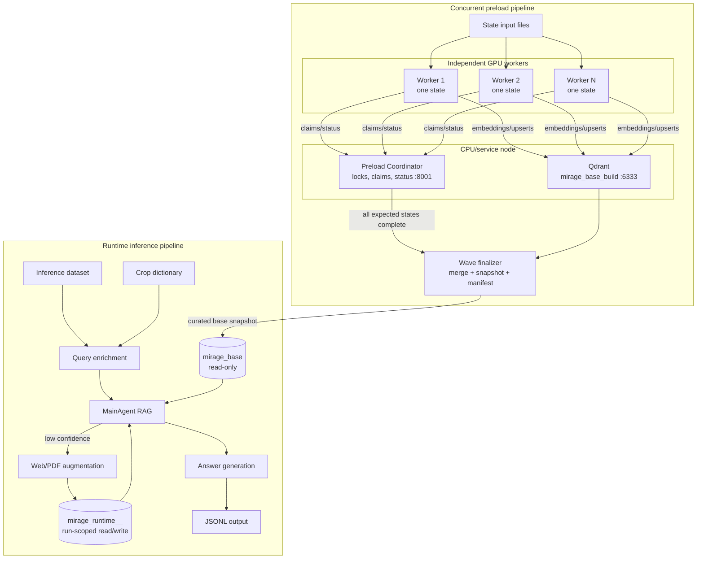
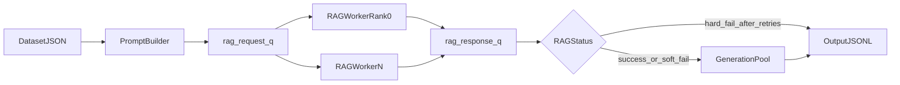

# MIRAGE-RAG

MIRAGE-RAG is an end-to-end agricultural retrieval-augmented generation system built for large-scale batch inference. It combines offline knowledge ingestion, metadata-aware retrieval, confidence-guided web augmentation, and multi-process GPU runtime orchestration.

This codebase is built on top of the MIRAGE benchmark project and extends it with a production-style RAG pipeline, ingestion stack, and ablation-driven runtime controls.

## Architecture At A Glance

- **Qdrant** provides the curated `mirage_base` collection and run-scoped runtime collections used by inference.
- **Optional query enrichment** injects crop context into the user question when crop names are implicit.
- **Runtime RAG workers** retrieve merged evidence from `mirage_base` plus an ablation-scoped `mirage_runtime_<ABLATION_ID>_<timestamp>` collection, score confidence, and optionally augment the runtime collection via web/PDF ingestion.
- **Generation stage** combines `effective_query` and retrieved context to produce final outputs.
- **Ablation controls** toggle key mechanisms (progressive filtering, confidence, web search, domain filtering, ingestion loop) for controlled experiments.



## Setup

### Prerequisites

- **Python** 3.12+ recommended (match your cluster modules if applicable).
- **Git** for checkout.
- **GPU + CUDA-compatible driver** for batch inference and for embedding offload at scale; preload can run CPU-only depending on workload (slower).

### Install

```bash
git clone <repository-url>
cd <repo-directory>   # checkout directory name, often MIRAGE-RAG

python -m venv .venv
# Windows PowerShell:
# .\.venv\Scripts\Activate.ps1
# Linux / macOS:
source .venv/bin/activate

# Store Hugging Face model caches on the 1 TB storage volume.
mkdir -p /projects/bfox/ssingh38/huggingface_cache/hub
mkdir -p /projects/bfox/ssingh38/triton_cache
export HF_HOME=/projects/bfox/ssingh38/huggingface_cache
export HUGGINGFACE_HUB_CACHE=/projects/bfox/ssingh38/huggingface_cache/hub
export TRITON_CACHE_DIR=/projects/bfox/ssingh38/triton_cache

echo $HF_HOME
echo $HUGGINGFACE_HUB_CACHE
echo $TRITON_CACHE_DIR

python -m pip install --upgrade pip wheel setuptools
pip install -r requirements.txt
```

Install **from the repository root** so `pip` resolves paths correctly.

**Pin file.** **`requirements.txt`** is the single consolidated **`package==version`** snapshot for preload tooling, embeddings, Qdrant client/runtime dependencies, **`sglang`/`vllm`**, ADK-era clients, and CUDA-associated wheels (**~346** pins; **`pip`/`setuptools`/`wheel`** are omitted). Refresh from **`pip freeze`** when you recreate a canonical environment (**`Guide.md` §§8.7–8.7.1**).

### Optional sanity check

```bash
python -c "import torch; import importlib.metadata as m; print('torch', torch.__version__, '| SGLang', m.version('sglang'))"
python -c "import qdrant_client, sentence_transformers; print('qdrant-client + sentence-transformers OK')"
```

### Runtime servers and HPC

- Start **OpenAI-compatible** LLM servers (project examples use **SGLang**) and align ports with **`Inference/generate.py`** — see **`Guide.md` §5.8** and **§8.7**.
- If **`pip install -r requirements.txt`** fails on CUDA wheels, resolve PyTorch/CUDA via your operator’s wheels or modules, then rerun the install (see **`Guide.md` §8.7**).

## Pipeline Components

### Runtime Batch Inference

### Concurrent Preload

The preload pipeline is implemented under `preload_pipeline/NEW-ARCHITECTURE/`. Each generic worker notebook processes one state on its own GPU allocation, so multiple states can be ingested concurrently into one cumulative Qdrant collection. State-local SQLite ledgers, canonical stores, crop outputs, and manifests prevent workers from sharing mutable local files. The Preload Coordinator API owns state leases and atomic build-level deduplication claims; workers send vectors directly to Qdrant. A separate wave finalization step validates all expected states, merges crop outputs, and creates the cumulative snapshot. See [`new-architecture-preload-pipeline.md`](preload_pipeline/NEW-ARCHITECTURE/new-architecture-preload-pipeline.md) and [`run.md`](preload_pipeline/NEW-ARCHITECTURE/run.md).

#### Original/direct command

For the original command-line setup, run from `Inference/`:

```bash
python generate.py \
  --input_file ../Datasets/standard/standard_benchmark.json \
  --output_file results/base_web_search/Llama-3.2-11B-Vision-Instruct.json \
  --model_name meta-llama/Llama-3.2-11B-Vision-Instruct \
  --openai_api_base http://127.0.0.1:11434/v1 \
  --num_processes 8 \
  --embed_model_name BAAI/bge-base-en-v1.5 \
  --test_model meta-llama/Llama-3.2-11B-Vision-Instruct \
  --device None \
  --ablation_id <ABLATION_ID>
```

`BENCH_TYPE` is specified in `Inference/bash_generate.sh` and determines the input dataset path:

```bash
BENCH_TYPE="standard"
INPUT_FILE="../Datasets/${BENCH_TYPE}/${BENCH_TYPE}_benchmark.json"
```

Use the exact ablation key from `rag_agent/ablation_configs.json`, for example `ablation_2_static_rag` or `ablation_7_full_no_domain_filter`. An unknown key falls back to default runtime toggles and is not suitable for a controlled ablation run.

Input-image combining is controlled independently from ablations. It is disabled by default; enable it for a model or run that benefits from receiving one labeled panel image by adding `--combine_input_images true` to the direct command. In `Inference/bash_generate.sh`, set `COMBINE_INPUT_IMAGES="true"` or `"false"`. When disabled, valid input images are sent individually; when enabled, up to the first three images are combined and labeled as separate panels.

Batch inference (`Inference/generate.py`) coordinates RAG and generation across multiple workers and endpoints.

- Reads input JSON and skips already successful items in output JSONL.
- Uses multiprocessing (`spawn`) and GPU-aware endpoint assignment.
- Resolves the base/runtime collections once before workers start; rank0 starts first, then remaining workers receive the same runtime collection name.
- Builds user prompt with optional location prefix.
- Applies query enrichment (optional) -> `effective_query`.
- Runs RAG retrieval/confidence/web-augmentation flow.
- Runs final generation and writes structured JSONL output.

Run from `Inference/`:

```bash
bash bash_generate.sh
```

`bash_generate.sh` sets experiment configuration (including `ABLATION_ID` and the independent `COMBINE_INPUT_IMAGES` setting) and launches `generate.py`.

The database lifecycle can also be controlled directly:

```bash
python generate.py \
  --input_file DATA.json \
  --output_file results.jsonl \
  --ablation_id full_system \
  --runtime_mode resume \
  --base_collection mirage_base
```

Useful overrides are `--runtime_mode fresh`, `--runtime_collection_override NAME`, `--use_base_collection false`, and `--snapshot_runtime`. Resume is the default. A fresh run deletes only live runtime collections matching the current ablation; it never deletes `mirage_base`.



## Core Runtime Mechanisms

### Base/runtime database isolation

Inference uses one immutable curated collection and one mutable run-scoped collection:

- `mirage_base`: must already exist for normal/final inference and is never created, reset, deleted, or upserted by inference.
- `mirage_runtime_<ABLATION_ID>_<YYYYMMDD>_<HHMMSS>`: created for a new run, shared across all queries in that run, preserved on failure, optionally snapshotted on success, and deleted after successful finalization.
- `USE_BASE_COLLECTION=False`: disables only base verification, base retrieval, and base-side deduplication. The same lifecycle, dual retriever, confidence path, and runtime-only ingestion remain active.

The dual retriever searches both collections for each retrieval strategy, merges and content-hash-deduplicates hits, prefers the base copy on duplicate hashes, globally ranks by raw Qdrant cosine similarity (higher is better), and attaches `retrieval_source` (`base` or `runtime`). Web/PDF ingestion always writes to runtime; when base is enabled, duplicate checks inspect base before runtime.

### Progressive Filtering and Metadata Strategy

Retrieval in `ContentUtils.retrieve_with_priority_filters` evaluates a ladder of metadata filters and semantic-only fallback.

- Candidate filters combine `hardiness_zone`, `month_year`, and `title` when available.
- `location` is normalized and used to derive `hardiness_zone`; filtering is not a raw location string match.
- Each strategy runs a query and is scored by the mean of transformed raw Qdrant cosine similarities across top-k hits (`1 / (2 - q)`).
- Best valid strategy is selected by score, not just first-hit order.
- Semantic-only retrieval remains the safety fallback.

### Hardiness Zone, Time, and Title Filters

Metadata quality directly affects retrieval precision.

- `location` at ingestion is used to derive `hardiness_zone`.
- `month_year` supports time-constrained retrieval.
- `title` helps source-scoped retrieval when document identity matters.
- Missing/low-quality metadata reduces strict-filter effectiveness and increases reliance on semantic-only retrieval.

### Confidence Evaluation

`ConfidenceEvaluator` scores retrieval confidence and drives branch behavior.

- Uses similarity and evidence characteristics from retrieved chunks.
- Applies strategy-scope weighting (stricter metadata alignment typically increases confidence).
- Guides whether the agent returns evidence directly or triggers augmentation.

### Web Augmentation with Filtered Domains

When confidence is low, the agent can perform keyword-guided web search and ingest new pages.

- Domain filtering can prioritize agricultural `.edu` sources tied to location/hardiness metadata.
- Ingested pages are chunked and stored with canonical metadata.
- Retrieval and confidence are re-run after augmentation.

### Ingestion Loop Behavior

Low-confidence branch runs an ingestion loop with bounded retries.

- Extracts keywords (single-pass guarded behavior).
- Performs web search and attempts content ingestion.
- Targets a minimum successful-ingestion threshold before reretrieval.
- Stops after configured attempt bounds, then returns best possible grounded response.

## Ablation Framework and Setup

Ablation behavior is controlled by three linked components:

- Run selector: `Inference/bash_generate.sh` via `ABLATION_ID`
- Ablation map: `rag_agent/ablation_configs.json`
- Prompt/instruction templates: `rag_agent/model_instructions.md`

Typical ablation toggles include:

- Progressive filtering on/off
- Confidence evaluation on/off
- Web search on/off
- Domain filtering on/off
- Ingestion loop behavior toggles

This framework enables controlled experiments while keeping the runtime entrypoint stable.

## Core Artifacts and Consistency Rules

Two artifacts are intentionally distinct:

- **`mirage_base` Qdrant collection**: curated chunk embeddings + metadata used for normal retrieval; immutable during inference.
- **`mirage_runtime_<...>` Qdrant collection**: run-scoped runtime chunks and web/PDF augmentation; lifecycle-managed by inference.
- **Crop dictionary JSON**: optional query rewrite context only.

Critical alignment requirements:

- Keep Qdrant collection and metadata contract aligned between preload and runtime.
- Match embedding model/device between preload and inference.
- Preserve canonical store + SQLite ledger + run snapshots for resumable state processing.

## Repository Map

- `rag_agent/`: main RAG agent, tools, retrieval logic, confidence evaluator, ablation controls.
- `preload_pipeline/`: notebook-orchestrated offline preload architecture and crop dictionary tooling.
- `Inference/`: batch runtime orchestration (`generate.py`, launch scripts, output flow).
- `chat_models/`: model client utilities for answer generation flows.
- `Datasets/`: metadata support tables (state/domain/hardiness mappings).

## Minimal Run Checklist

Before preload:

- Start Qdrant on the same compute node as Jupyter and verify connectivity.
- Ensure support files exist: `county_state_hardiness_zone.csv` and `crop_occurrences.json`.
- Ensure only intended state input files are present for auto-discovery.

Before inference:

- Verify OpenAI-compatible model endpoints are reachable.
- Verify Qdrant URL and that `mirage_base` exists for normal inference (or deliberately pass `--use_base_collection false`).
- Verify runtime mode, ablation ID, embedding model, and device alignment. Do not manually construct runtime collection names unless using the explicit override.
- Verify ablation config (`ABLATION_ID`) and template references.
- Verify crop dictionary placement if enrichment is enabled.

## Built On MIRAGE Benchmark

This project is built on and extends MIRAGE benchmark assets and concepts. Please cite MIRAGE when using this codebase in derivative research outputs.

- MIRAGE repository: [MIRAGE-Benchmark/MIRAGE-Benchmark](https://github.com/MIRAGE-Benchmark/MIRAGE-Benchmark)
- MIRAGE paper: [MIRAGE: A Benchmark for Multimodal Information-Seeking and Reasoning in Agricultural Expert-Guided Conversations (arXiv:2506.20100)](https://arxiv.org/abs/2506.20100)

## Lead Contributors

- Shashank Singh: Master of Computer Science Student ([LinkedIn](https://www.linkedin.com/in/shashank-p-singh/))
- Tushar Gupta: MS Student, Agricultural and Biological Engineering ([LinkedIn](https://www.linkedin.com/in/tusharr-gupta/))
- Advisor: Dr. John F. Reid ([Faculty Profile](http://siebelschool.illinois.edu/about/people/faculty/j-reid1))

## Additional Documentation

- `Guide.md`: full architecture and implementation details.
- `Documentation.md`: runtime queue/worker design and failure handling.
- `preload_pipeline/NEW-ARCHITECTURE/new-architecture-preload-pipeline.md`: concurrent state-worker architecture and invariants.
- `preload_pipeline/NEW-ARCHITECTURE/MetaMIRAGE_Concurrent_Preload_Worker.ipynb`: generic one-state worker notebook.
- `preload_pipeline/NEW-ARCHITECTURE/run.md`: concurrent wave execution guide.
- `preload_pipeline/NEW-ARCHITECTURE/qdrant_delta_setup_context.md`: Qdrant setup and snapshot reuse.
- `Inference/README.md`: runtime arguments and enrichment flags.
- `Guide.md` §8.2: runtime query enrichment behavior and safeguards.
